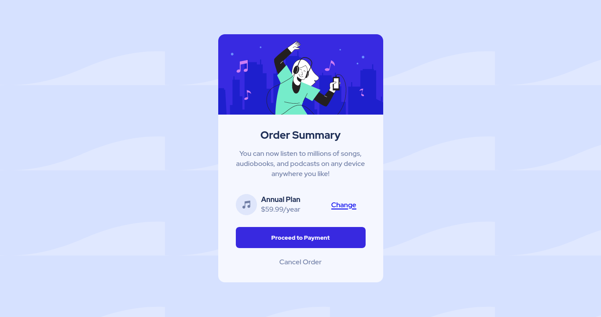

# Frontend Mentor - Order summary card

This is a solution to the [Order summary card challenge on Frontend Mentor](https://www.frontendmentor.io/challenges/order-summary-component-QlPmajDUj). Frontend Mentor challenges help you improve your coding skills by building realistic projects. 

### Screenshot

### Links

- Solution URL: [https://www.frontendmentor.io/solutions/order-summary-component-using-flexbox-cmdKRck16z]
- Live Site URL: [https://belkysupreme22.github.io/order-summary-component.io/]

## My process

### Built with

- Semantic HTML5 markup
- CSS custom properties
- Flexbox
## Author

- Name - [ABeamlak]
- Frontend Mentor - [@belkysupreme22](https://www.frontendmentor.io/profile/belkysupreme22)
